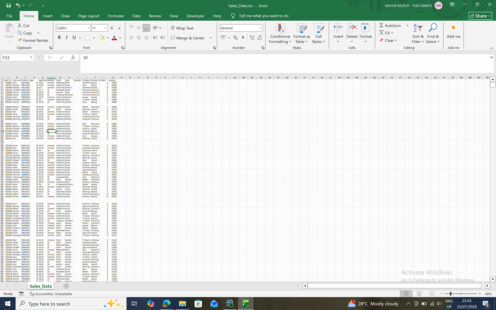
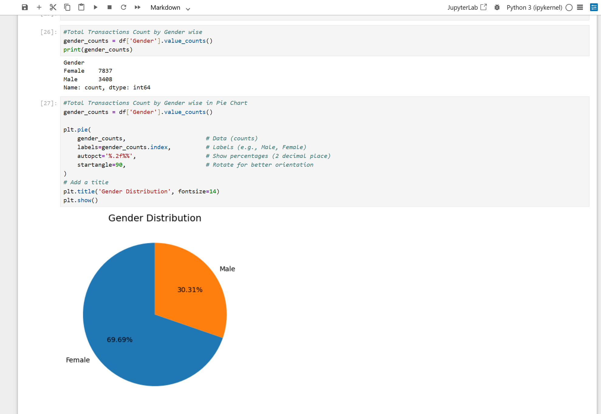
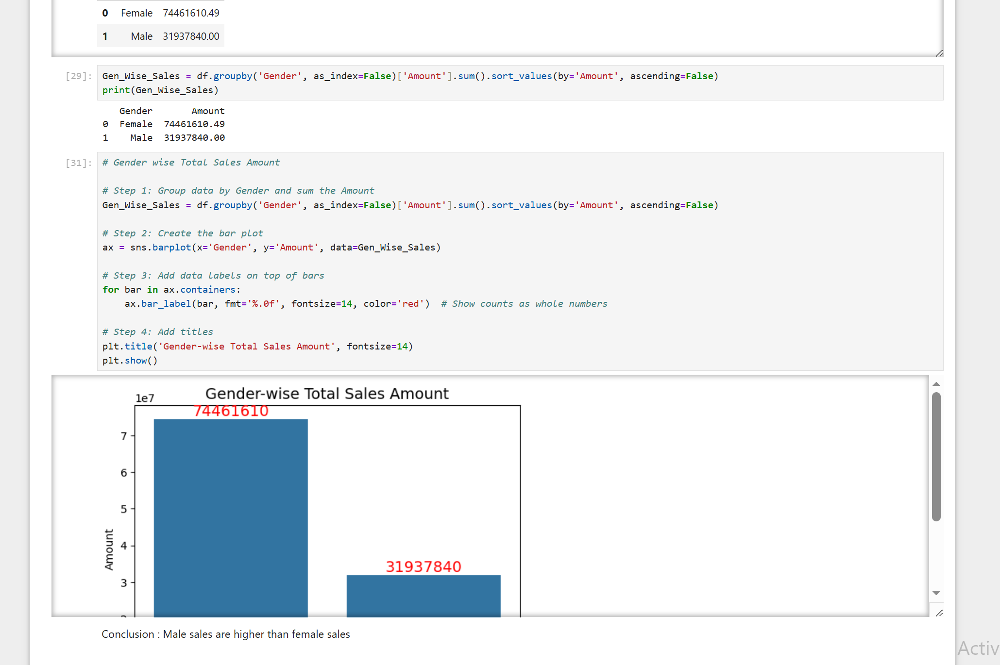
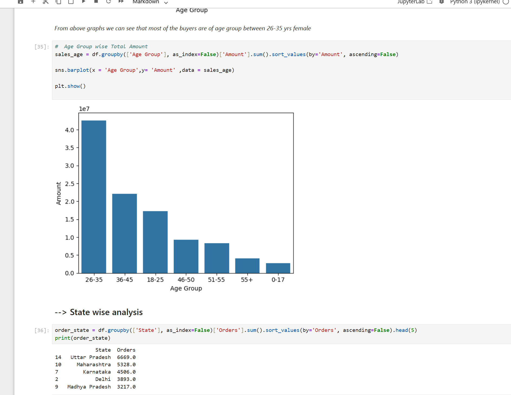
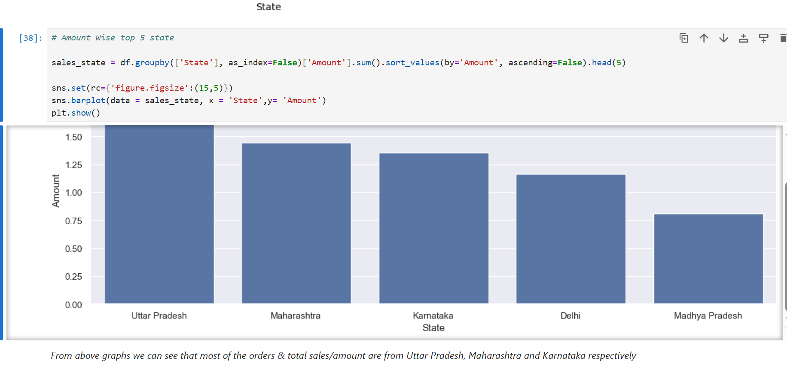
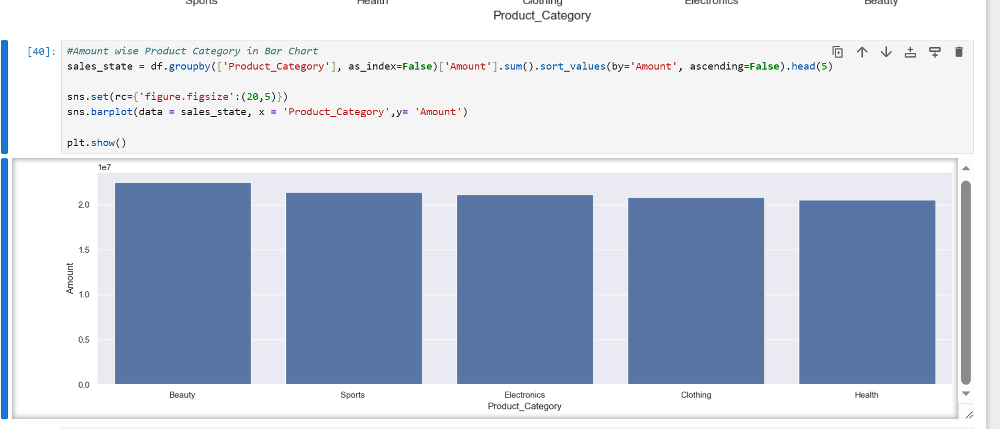
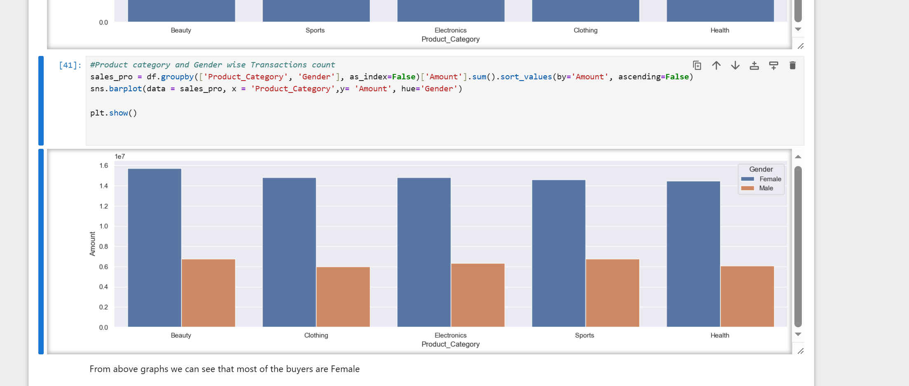
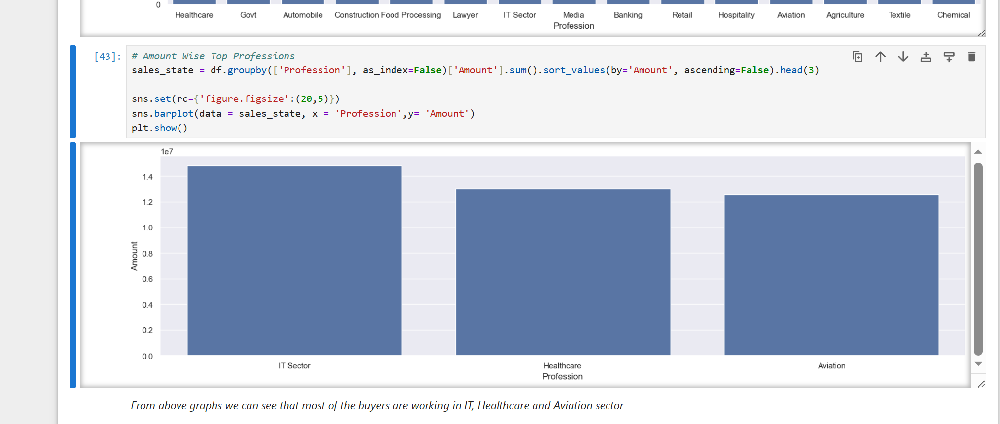
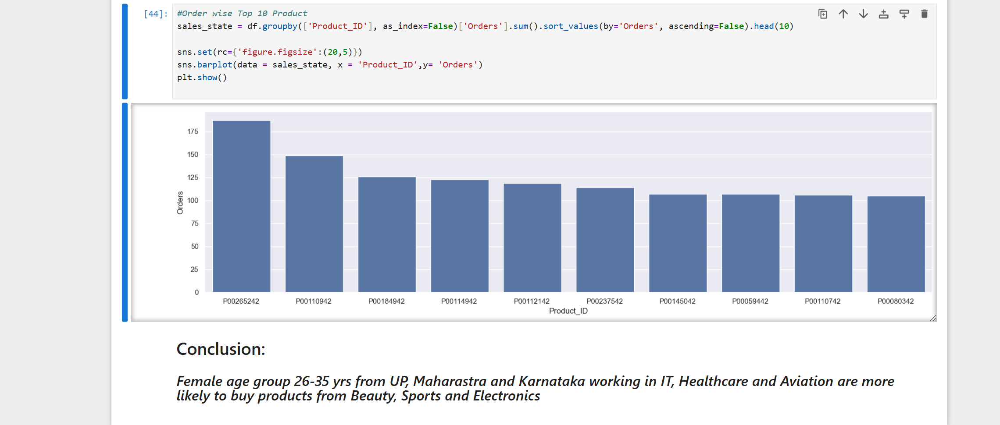

# 📊 Sales Data Analysis using Python

> **Exploratory Data Analysis (EDA) project built using Python to analyze retail sales data, identify customer purchasing patterns, and generate meaningful business insights through data visualization.**

---

# 📌 Project Overview

This project demonstrates a complete Exploratory Data Analysis (EDA) workflow using Python and Jupyter Notebook. The dataset contains customer demographics, product details, order information, and sales amounts. The analysis focuses on identifying customer behavior, sales trends, top-performing states, product categories, and business insights using effective data visualization techniques.

---

# 🎯 Objectives

- Import and explore the sales dataset
- Clean and preprocess the data
- Analyze customer demographics
- Identify purchasing patterns
- Compare sales across states
- Analyze product category performance
- Create meaningful visualizations
- Generate business insights

---

# 🛠️ Tech Stack

| Tool | Purpose |
|------|---------|
| Python | Data Analysis |
| Pandas | Data Manipulation |
| NumPy | Numerical Computing |
| Matplotlib | Data Visualization |
| Seaborn | Statistical Visualization |
| Jupyter Notebook | Development Environment |

---

# 📂 Dataset Features

The dataset includes the following fields:

- User ID
- Customer Name
- Product ID
- Age
- Age Group
- Gender
- State
- Zone
- Zip Code
- Profession
- Product Category
- Orders
- Amount

---

# 📈 Exploratory Data Analysis (EDA)

The project includes:

- ✅ Data Import
- ✅ Data Cleaning
- ✅ Dataset Information
- ✅ Missing Value Analysis
- ✅ Gender-wise Transaction Analysis
- ✅ Gender Distribution Analysis
- ✅ Gender-wise Sales Analysis
- ✅ Age Group-wise Transaction Analysis
- ✅ Age Group-wise Sales Analysis
- ✅ Top 5 States by Quantity Ordered
- ✅ Top 5 States by Total Sales
- ✅ Product Category-wise Transaction Analysis
- ✅ Product Category-wise Sales Analysis
- ✅ Product Category vs Gender Analysis
- ✅ Profession-wise Transaction Analysis
- ✅ Top Professions by Sales Amount
- ✅ Top 10 Products by Quantity Ordered

---

# 📊 Project Preview

## Dataset Preview



---

## Gender Distribution



---

## Gender-wise Sales



---

## Age Group Analysis



---

## Top 5 States by Sales



---

## Product Category Analysis



---

## Product Category vs Gender



---

## Top Professions by Sales



---

## Top 10 Products by Quantity



---

# 🚀 Key Insights

- Female customers contributed significantly to overall sales.
- The 26–35 age group generated the highest number of purchases.
- Sales were concentrated in a few top-performing states.
- Product categories showed different purchasing behavior across genders.
- Certain professions contributed more to overall sales than others.
- A small number of products generated a significant share of total orders.

---

# 📁 Project Structure

```text
Python-Sales-Data-Analysis-EDA/
│
├── Dataset/
│   └── Sales_Data.csv
│
├── Images/
│   ├── 01_Dataset_Preview.PNG
│   ├── 02_Data_Info.PNG
│   ├── 03_Missing_Values_Check.PNG
│   ├── 04_Gender_Transactions_BarChart.PNG
│   ├── 05_Gender_Distribution_PieChart.PNG
│   ├── 06_Gender_Sales_BarChart.PNG
│   ├── 07_Age_Group_Transaction_BarChart.PNG
│   ├── 08_Age_Group_Sales_BarChart.PNG
│   ├── 09_Top5_States_Quantity_BarChart.PNG
│   ├── 10_Top5_States_Sales_BarChart.PNG
│   ├── 11_Product_Category_Transaction_BarChart.PNG
│   ├── 12_Product_Category_Sales_BarChart.PNG
│   ├── 13_Product_Category_Gender_BarChart.PNG
│   ├── 14_Profession_Transaction_BarChart.PNG
│   ├── 15_Top_Profession_Sales_BarChart.PNG
│   └── 16_Top10_Products_Quantity_BarChart.PNG
│
├── Notebook/
│   └── Analysis_on_sales_data_project.ipynb
│
├── README.md
├── requirements.txt
├── .gitignore
└── LICENSE
```

---

# ⚙️ Installation

Clone the repository:

```bash
git clone https://github.com/MayurRajput22/Python-Sales-Data-Analysis-EDA.git
```

Install the required libraries:

```bash
pip install -r requirements.txt
```

Launch Jupyter Notebook:

```bash
jupyter notebook
```

---

# 📚 Libraries Used

```python
import pandas as pd
import numpy as np
import matplotlib.pyplot as plt
import seaborn as sns
```

---

# 💡 Learning Outcomes

- Data Cleaning
- Exploratory Data Analysis (EDA)
- Business Insight Generation
- Data Visualization
- Customer Behaviour Analysis
- Sales Trend Analysis
- Python for Data Analytics
- GitHub Project Documentation

---

# 📄 License

This project is licensed under the **MIT License**.

---

# 👨‍💻 Author

**Mayur Rajput**

🎓 B.Pharm + MBA (Integrated)  
🏫 NMIMS University

### Technical Skills

- Python
- Pandas
- NumPy
- Matplotlib
- Seaborn
- Data Analysis
- Exploratory Data Analysis (EDA)
- Data Visualization
- Jupyter Notebook
- Git & GitHub

---

## ⭐ If you found this project useful, please consider giving it a Star.
